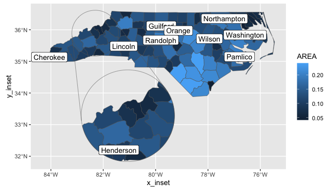

<!-- README.md is generated from README.Rmd. Please edit that file -->

# ggmapinset

<!-- badges: start -->
<!-- badges: end -->

Add zoomed inset panels to your ggplot maps.

## Installation

You can install the development version of ggmapinset like so:

``` r
# install.packages("remotes")
remotes::install_github("cidm-ph/ggmapinset")
```

## Example

This example adds an inset to the first example from `ggplot2::geom_sf`.
The inset area is defined as a circle centred on the named county, with
radius 50 miles. The inset is enlarged by a factor of 2 and shifted to
an empty part of the map.

``` r
library(ggmapinset)
library(ggplot2)
library(sf)

nc <- sf::st_read(system.file("shape/nc.shp", package = "sf"), quiet = TRUE)

cfg <- configure_inset(centre = st_centroid(st_geometry(nc)[nc$NAME == "Yancey"]),
                       scale = 2, translation = c(70, -180), radius = 50, units = "mi")

# The basic ggplot example:
# ggplot(nc) +
#  geom_sf(aes(fill = AREA))

# Adding an inset means replacing geom_sf(...) -> geom_sf_inset(..., inset = cfg)
ggplot(nc) +
  geom_sf_inset(aes(fill = AREA), inset = cfg) +
  geom_inset_frame(inset = cfg) +
  coord_sf()
```


