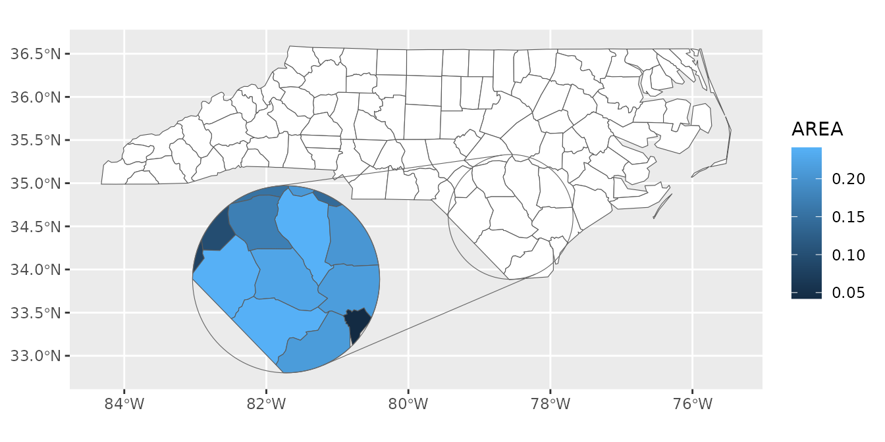
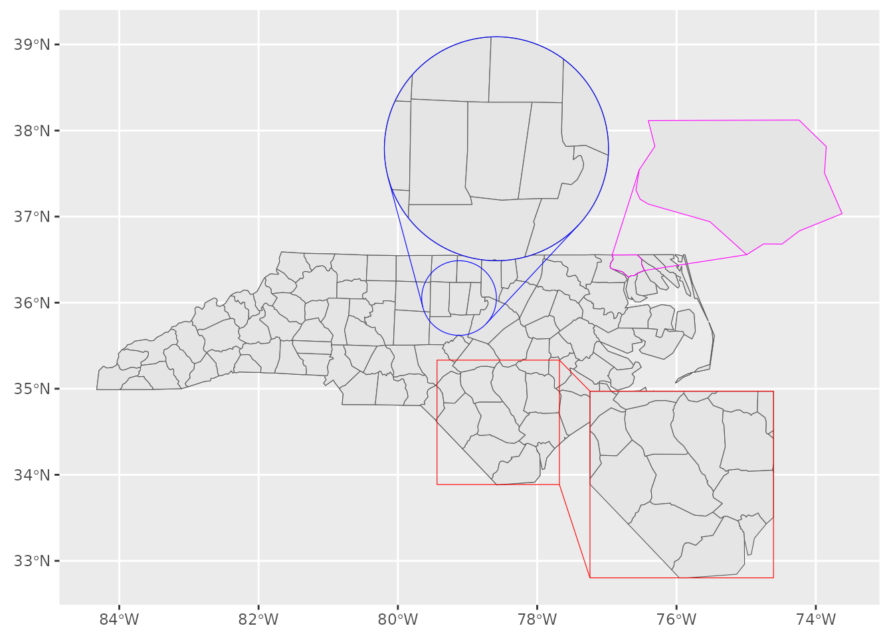

# Getting started with 'ggmapinset'

``` r
library(ggmapinset)
#> Loading required package: sf
#> Linking to GEOS 3.12.1, GDAL 3.8.4, PROJ 9.4.0; sf_use_s2() is TRUE
library(ggplot2)

nc <- sf::st_read(system.file("shape/nc.shp", package = "sf"), quiet = TRUE)
```

This article provides some recipes for working with insets.

## Example usage

This example uses the mosquito surveillance dataset
[`ggmapinset::mozzies_nsw2301`](https://cidm-ph.github.io/ggmapinset/reference/mozzies_nsw2301.md).
It includes points from across New South Wales.

``` r
head(mozzies_nsw2301)
#> # A tibble: 6 × 7
#>   location week_ending species             count type     lat  long
#>   <chr>    <date>      <fct>               <ord> <fct>  <dbl> <dbl>
#> 1 Albury   2023-01-07  Culex annulirostris low   inland -36.1  147.
#> 2 Albury   2023-01-07  Aedes vigilax       NA    inland -36.1  147.
#> 3 Albury   2023-01-07  total               low   inland -36.1  147.
#> 4 Albury   2023-01-14  Culex annulirostris high  inland -36.1  147.
#> 5 Albury   2023-01-14  Aedes vigilax       NA    inland -36.1  147.
#> 6 Albury   2023-01-14  total               high  inland -36.1  147.
```

Firstly, we can recreate the basic maps from the report accompanying the
dataset. Since the dataset has latitude and longitude coordinates, it
can easily be converted into a spatial data frame with
[`sf::st_as_sf()`](https://r-spatial.github.io/sf/reference/st_as_sf.html).

``` r
library(dplyr)
library(sf)

# just take the total count from a single week of the data
mozzies <- mozzies_nsw2301 |>
  filter(species == "total", week_ending == as.Date("2023-01-07")) |>
  st_as_sf(coords = c("long", "lat"), crs = st_crs("WGS84"))

labels <- c("Low (<50)", "Medium (50-100)", "High (101-1,000)",
            "Very High (1,001-10,000)", "Extreme (>10,000)")

scale1 <- scale_colour_manual(
  name = NULL,
  values = c("green", "gold", "darkorange", "red", "black"),
  labels = labels,
  na.value = "grey",
  drop = FALSE
)
scale2 <- scale_size_ordinal(
  name = NULL,
  labels = labels,
  range = c(3, 5),
  na.value = 2,
  drop = FALSE
)

ggplot(mozzies) +
  geom_sf(data = nswgeo::nsw, fill = NA) +
  geom_sf(aes(size = count, colour = count)) +
  geom_sf_text(aes(label = location), hjust = 0, nudge_x = 0.25, size = 3) +
  coord_sf(xlim = c(NA, 158)) +
  scale1 + scale2 +
  theme_void()
#> Warning in st_point_on_surface.sfc(sf::st_zm(x)): st_point_on_surface may not
#> give correct results for longitude/latitude data
```


The warning about
[`sf::st_point_on_surface`](https://r-spatial.github.io/sf/reference/geos_unary.html)
can be disregarded. Any errors due to the coordinate system are unlikely
to make much visual difference to where text is placed in this case.

This plot looks a little congested. We can improve things a bit by using
the repulsive version of the label geom from
[ggrepel](https://ggrepel.slowkow.com/):

``` r
library(ggrepel)

ggplot(mozzies) +
  geom_sf(data = nswgeo::nsw, fill = NA) +
  geom_sf(aes(size = count, colour = count)) +
  geom_text_repel(
    aes(label = location, geometry = geometry),
    hjust = 0,
    nudge_x = 0.25,
    size = 3,
    max.overlaps = 15,
    point.padding = 0,
    min.segment.length = 1,
    stat = "sf_coordinates"
  ) +
  coord_sf(xlim = c(NA, 158)) +
  scale1 + scale2 +
  theme_void()
#> Warning in st_point_on_surface.sfc(sf::st_zm(x)): st_point_on_surface may not
#> give correct results for longitude/latitude data
#> Warning: ggrepel: 7 unlabeled data points (too many overlaps). Consider
#> increasing max.overlaps
```


The main thing to note above is that
[`geom_text_repel()`](https://ggrepel.slowkow.com/reference/geom_text_repel.html)
is not hooked into the [ggplot2](https://ggplot2.tidyverse.org)’s
geospatial integration, so it needs to be told to use
[`stat_sf_coordinates()`](https://ggplot2.tidyverse.org/reference/stat_sf_coordinates.html)
to compute the coordinates, and it needs an explicit mapping for the
`geometry` aesthetic.

That improved most of the map except for the Sydney region where most of
the labels are missing since they would overlap. The `max.overlaps`
parameter to
[`geom_text_repel()`](https://ggrepel.slowkow.com/reference/geom_text_repel.html)
can help, but doesn’t address the overcrowding issue. This is where an
inset can help.

First we define the inset we want. We can collect up all the points from
the dataset that were labelled with `type == "sydney"` and use some
standard geospatial functions to get the diameter and centre of a circle
that will cover all those points. We then specify that we want this
circle to be enlarged by a factor of 4, and shifted to south and east:

``` r
sydney <- filter(mozzies, type == "sydney")
sydney_size <- st_distance(sydney, sydney) |> max() |> as.numeric() / 1000
sydney_centre <- st_union(sydney) |> st_centroid()

sydney_inset <- configure_inset(
  shape_circle(centre = sydney_centre, radius = sydney_size),
  translation = c(400, -200),
  scale = 4,
  units = "km"
)
```

Finally, we can repeat the previous plot with the `_inset` version of
the relevant layers. The inset configuration is passed to the coord. The
only other change is that to make sure the labels for Sydney sites
appear in the inset instead of the base map, we need to remap the `x`
and `y` aesthetics to the versions computed by the underlying stat.

``` r
ggplot(mozzies) +
  geom_sf_inset(data = nswgeo::nsw, fill = NA) +
  geom_sf_inset(aes(size = count, colour = count), map_base = "clip") +
  geom_text_repel(
    aes(
      x = after_stat(x_inset),
      y = after_stat(y_inset),
      label = location,
      geometry = geometry
    ),
    hjust = 0,
    nudge_x = 0.25,
    size = 3,
    force_pull = 2,
    max.overlaps = Inf,
    point.padding = 0,
    min.segment.length = 1,
    stat = "sf_coordinates_inset"
  ) +
  geom_inset_frame() +
  coord_sf_inset(xlim = c(NA, 158), inset = sydney_inset) +
  scale1 + scale2 +
  theme_void()
```


Further tweaks of label placement can be achieved by playing around with
the parameters of
[`geom_text_repel()`](https://ggrepel.slowkow.com/reference/geom_text_repel.html),
or by passing vectors of positions into the `nudge_x` and `nudge_y`
parameters.

## Different aesthetics for inset layer

By default,
[`geom_sf_inset()`](https://cidm-ph.github.io/ggmapinset/reference/geom_sf_inset.md)
creates two copies of the map layer: one for the base map and the other
for the inset map. The inset is transformed and clipped, but uses the
same underlying aesthetics mapping and parameters.

If you want to have different aesthetics for the two layers, you’ll need
to turn off this copying with `map_base = "none"`. With this parameter
set and an `inset` parameter provided, only the inset layer will be
drawn. To draw only the base layer, you can use `map_inset = "none"`,
`inset = NULL`, or simply use the normal
[`geom_sf()`](https://ggplot2.tidyverse.org/reference/ggsf.html).

``` r
ggplot(nc) +
  # this is equivalent to the following line:
  # geom_sf_inset(fill = "white", map_inset = "none") +
  geom_sf(fill = "white") +
  geom_sf_inset(aes(fill = AREA), map_base = "none") +
  geom_inset_frame() +
  coord_sf_inset(configure_inset(
    shape_circle(
      centre = sf::st_centroid(sf::st_geometry(nc)[nc$NAME == "Bladen"]),
      radius = 50
    ),
    scale = 1.5, translation = c(-180, -50),  units = "mi"
  ))
```



## Inset frame backgrounds

By default, the inset frame is transparent, although often it makes
sense to add a solid background so that the inset is distinguishable
from any overlapping part of the base map. The aesthetics of the two
parts of the frame and the burst lines connecting them can be controlled
separately.

Note that when the background is filled, we need to specify the base and
inset maps in separate layers so that the frame can slip in between
them.

``` r
ggplot(nc) +
  geom_sf(aes(fill = AREA)) +
  geom_inset_frame(target.aes = list(fill = "white")) +
  geom_sf_inset(aes(fill = AREA), map_base = "none") +
  coord_sf_inset(configure_inset(
    shape_circle(
      centre = st_centroid(st_geometry(nc)[nc$NAME == "Yancey"]),
      radius = 50
    ),
    scale = 2, translation = c(100, -120), units = "mi"
  ))
```


## Multiple insets

For multiple insets, the appropriate inset configuration just needs to
be passed to each layer separately. It’s probably clearer to avoid
providing an inset to the coordinate system in this case.

Since the inset-aware layers will duplicate themselves for the base and
inset maps, you will probably want to disable that behaviour with
`map_base = "none"` to avoid having multiple identical copies of the
base map.

``` r
inset1 <- configure_inset(
  shape_rectangle(
    centre = sf::st_centroid(nc[nc$NAME == "Bladen", ]),
    hwidth = 50
  ),
  scale = 1.5, translation = c(150, -50), units = "mi"
)
#> Warning: st_centroid assumes attributes are constant over geometries
inset2 <- configure_inset(
  shape_circle(
    centre = sf::st_centroid(nc[nc$NAME == "Orange", ]),
    radius = 30
  ),
  scale = 3, translation = c(30, 120), units = "mi"
)
#> Warning: st_centroid assumes attributes are constant over geometries
inset3 <- configure_inset(
  shape_sf(nc[nc$NAME == "Gates", ]),
  scale = 6, translation = c(90, 70), units = "mi"
)

ggplot(nc) +
  # base map
  geom_sf_inset() +
  # inset 1
  geom_sf_inset(map_base = "none", inset = inset1) +
  geom_inset_frame(inset = inset1, colour = "red") +
  # inset 2
  geom_sf_inset(map_base = "none", inset = inset2) +
  geom_inset_frame(inset = inset2, colour = "blue") +
  # inset 3
  geom_sf_inset(map_base = "none", inset = inset3, colour = NA) +
  geom_inset_frame(inset = inset3, colour = "magenta")
#> Warning in rep(pch, length.out = length(x)): 'x' is NULL so the result will be
#> NULL
```


